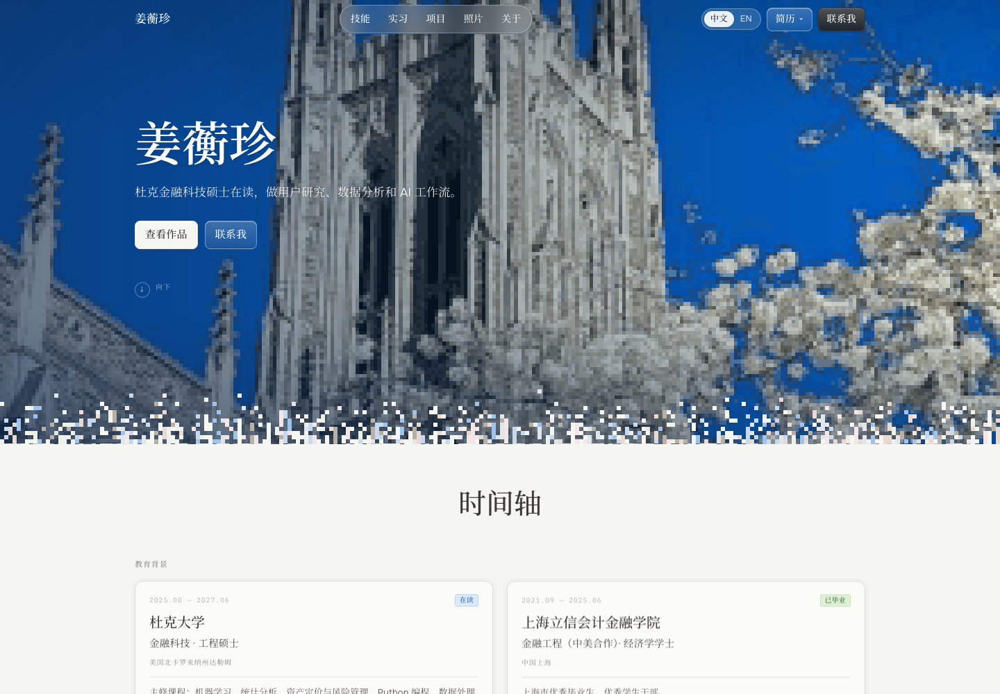

# hengzhenjiang.com

Personal site for Hengzhen Jiang (姜蘅珍): MEng Financial Technology at Duke, internships in
user research, business analytics, equity research and creator operations.

Live: https://hengzhen-jiang.vercel.app

The site is a single static HTML page, bilingual (Chinese by default, English on toggle),
with no framework and no build step at runtime. A small Python script assembles the page
from a template, a translation file and a handful of image lists.

## Preview



[Open the site](https://hengzhen-jiang.vercel.app). Use the language toggle in the header to switch between Chinese and English, then scroll through the timeline and project sections.

For a local demo, run `python3 -m http.server 8000 --directory site` and open `http://localhost:8000`. The committed build includes the images. This screenshot shows the local Chinese version at 1440 by 1000 on 2026-09-12.

## Layout of this repository

```
site/                     What gets deployed. Generated: do not edit by hand.
  index.html              The page (built from draft/index.template.html)
  assets/                 Images, résumé PDFs, collaboration thumbnails

draft/
  index.template.html     Source of the page: markup, CSS, JS and all English copy
  i18n.zh.json            All Chinese copy, keyed by the English string it replaces
  build.py                Builds site/ and draft/index.html
  collabs.py              The 19 creator posts shown in the Lovart section
  img/                    Hero image, portrait and small inline copies of photos
  index.html              Single-file build with images inlined (used for previews only)

source/resume/            Résumé PDFs picked up by the build
  Hengzhen_Jiang_Resume_EN.pdf
  Hengzhen_Jiang_Resume_ZH.pdf
```

Two folders are deliberately not in git: `current-site/` (a clone of the previous GitHub Pages
site, kept locally for the original 76-photo library) and `next steps/` (working documents).

## Building and deploying

Requirements: Python 3 with Pillow (`pip install pillow`), and `ffmpeg` if you add new photos.

```sh
python3 draft/build.py          # regenerates site/index.html and draft/index.html
cd site && vercel deploy --prod --yes
```

The build is idempotent and takes a couple of seconds. Derived images are committed, so a
fresh clone builds without the original photo library.

## Editing content

**English text** lives directly in `draft/index.template.html`. Search for the sentence you
want to change and edit it in place.

**Chinese text** lives in `draft/i18n.zh.json` as `"English string": "中文"` pairs. The page
swaps text nodes at runtime, so the key must match the English text exactly, including
punctuation. If you change an English sentence in the template, update its key here too, or
that sentence will fall back to English in the Chinese version. A couple of numbered captions
use the `patterns` list at the top of the file instead of exact keys.

**Résumés**: replace the PDFs in `source/resume/` keeping the same file names, then rebuild.
Both the header menu and the footer link to them.

**Field-note photos**: `ROW1` and `ROW2` at the top of `draft/build.py` list the photos in each
scrolling row as `(gallery number, caption)`. Captions are English; add the Chinese caption to
`i18n.zh.json`. Adding a photo that is not yet derived needs the original library in
`current-site/public/assets/gallery-v2/` and `ffmpeg`. The build refuses duplicate numbers.

**Creator collaborations**: `draft/collabs.py` lists the YouTube, Instagram, TikTok and X posts.
Thumbnails were fetched once into `site/assets/collabs/`; a new post needs its thumbnail added
there by hand (YouTube: `https://i.ytimg.com/vi/<id>/hqdefault.jpg`).

**Timeline, education, work and project entries** are plain HTML in the template.

## How the page works

- **Language**: a script in `<head>` reads the saved choice (default `zh`) before first paint,
  so there is no flash of the other language. The toggle in the header swaps every text node
  using the dictionary and stores the choice in `localStorage`. Chinese uses Noto Serif SC
  (思源宋体) from Google Fonts; English uses Onest with IBM Plex Mono for labels.
- **Animations**: sections reveal on scroll in both directions; stat cards count up and the
  feature-importance chart draws in when they enter the viewport. All motion respects
  `prefers-reduced-motion`.
- **Field notes and collaborations** are CSS marquees, duplicated once in JS for a seamless
  loop. YouTube tiles mount a muted preview player only while on screen (max three at once);
  tapping one opens the full video in a lightbox.
- **Hero**: a pixel-art rendering of Duke Chapel, generated from one of Hengzhen's photos.

## Credits

Design direction inspired by cofounder.co. Photos, résumé and copy © Hengzhen Jiang.
Creator videos and posts in the collaborations section belong to their respective creators
and open on their original platforms.
